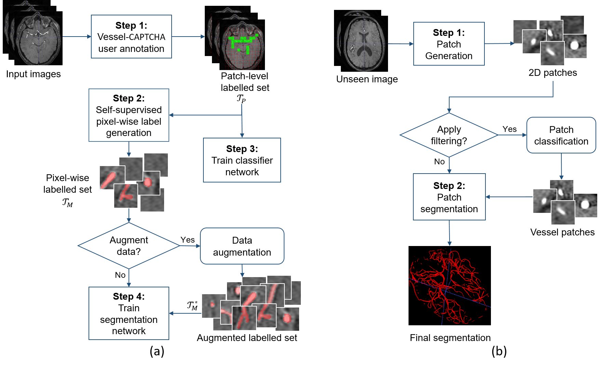

# Vessel-Captcha: An Efficient Learning Framework for Vessel Annotation and Segmentation



### 1. Pytorch Models

#### 2D-PnetCl: 

We defined a Pnet class in pnetcls_PT.py which serves as a pytroch implementation of the PnetCls model.

#### 2D-WnetSeg: 

We defined a Wnet class in wnet_PT.py which serves as a pytroch implementation of the Wnet model.

### 2. Training Models

#### Datasets:

To train the models, the function defined in train_PT.py uses pytorch dataloaders built using dataset classes defined in get_data_PT.py. Futher comments in get_data_PT.py detail the initialization of the class

#### 2D-PnetCl & 2D-WnetSeg Training: 

To train the PnetCls and WnetSeg models, we use the following function defined in train_PT.py:
```sh
train_PT_model(train_patch_dir = str, label_patch_dir = str, model_filepath = str, 
               validation_split = float,batch_size = int, 
               patch_size = int, normalize = bool, pixel_wise = bool, 
               epochs = int, Model = Pnet/Wnet, lr = float, momentum = float,
               criterion, optimizer)
```
The trained model is saved in model_filepath
criterion and optimizer are taken from torch.nn and torch.optim respectively
